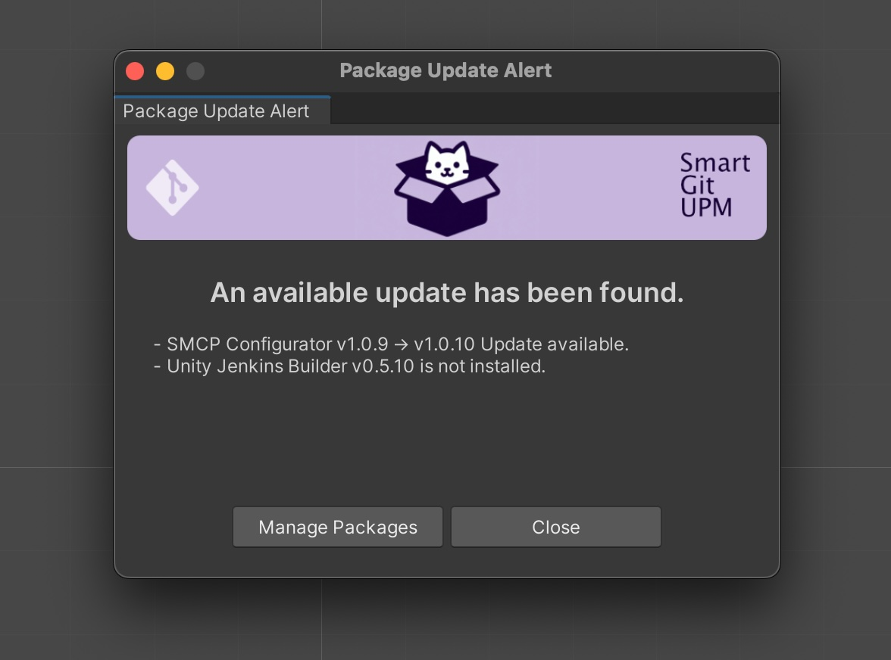
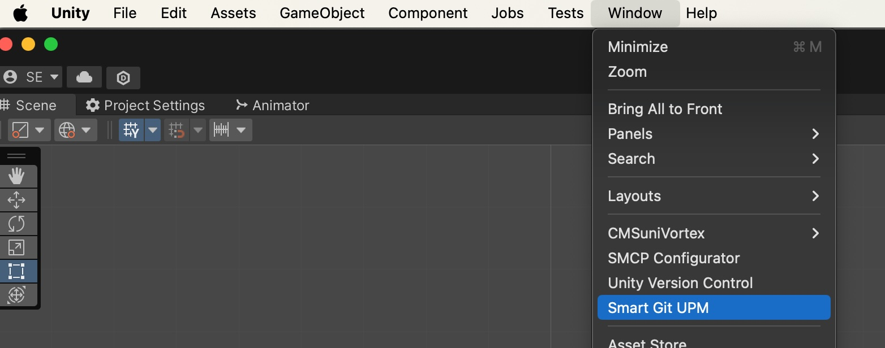
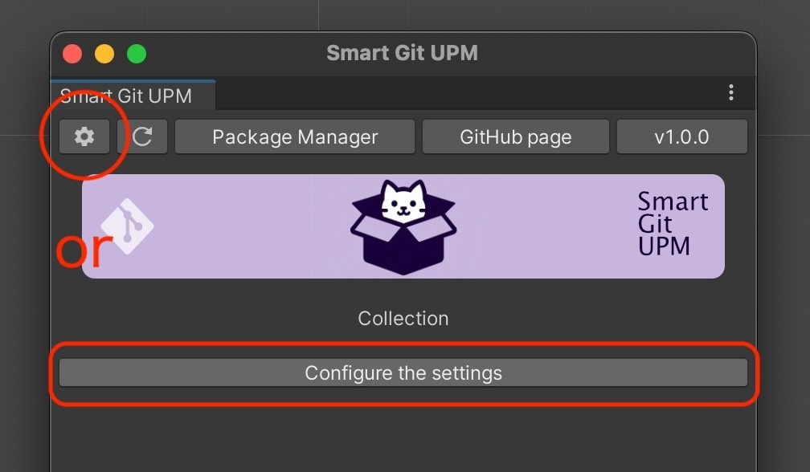
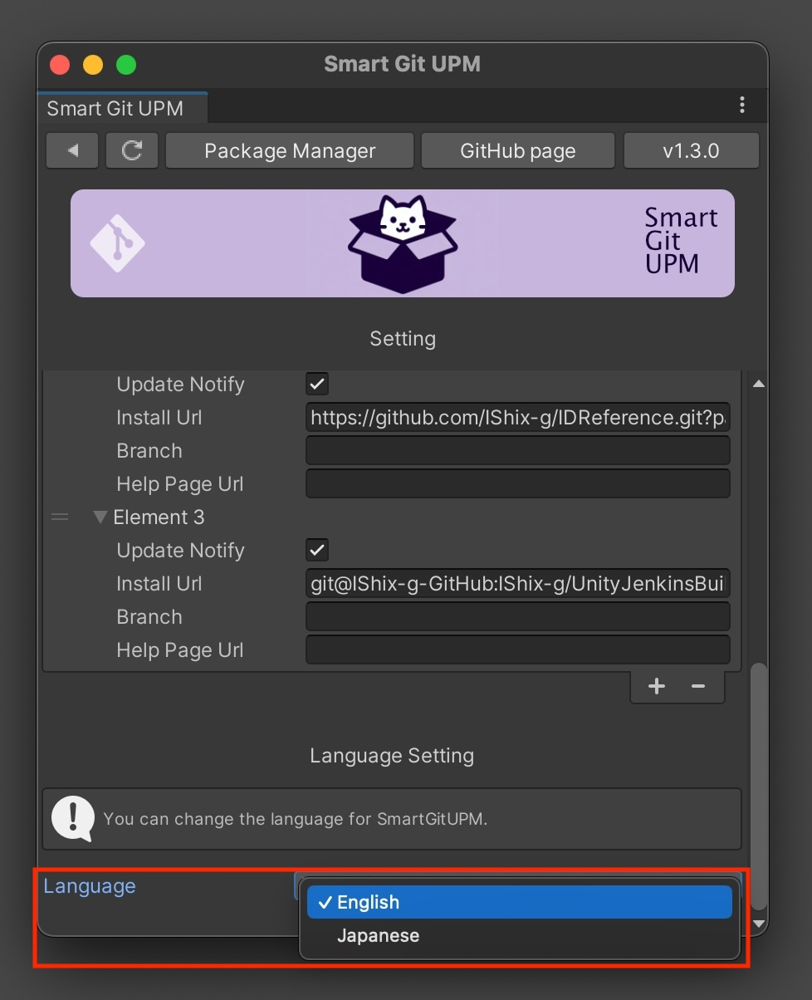
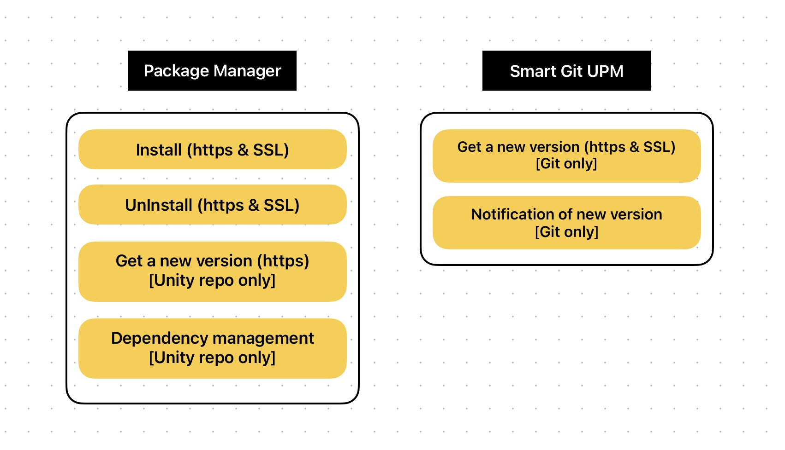
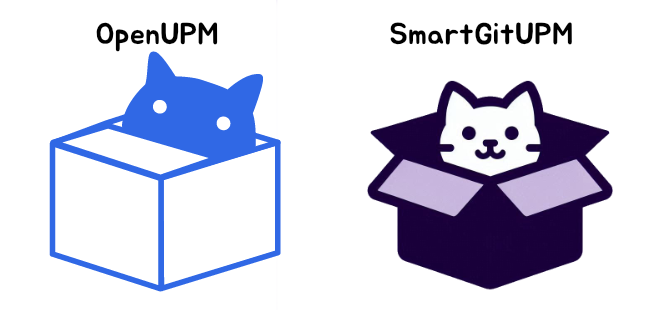

[README - 日本語版](README_jp.md)

> [!IMPORTANT]
> DISCLAIMER: SmartGitUPM is an open-source service, not an official service provided by Unity Technologies Inc.

# SmartGitUPM
A plugin for managing packages within Git repositories efficiently in Unity Editor.

## Why Use This Plugin

### View Updates at a Glance

Unity Package Manager doesn’t provide update information for packages published via Git. With `SmartGitUPM`, you can easily check updates with its user-friendly UI.

### Support for Private Repository Update Checks

Supports packages in private repositories (SSH connection). You can check updates even in private repositories.

- Configure SSH and set the SSH URL, for example, `git@github.com:IShix-g/SmartGitUPM.git`
- Large private repositories take longer to display the first time.
- The size of a public repository does not affect display speed.

### Update Notifications

Receive notifications of package updates every time you open Unity Editor. (Notifications can be turned off)

### Uses UPM Internally, So It's Safe

Internally, it uses Unity Package Manager (UPM) for package management, making it reliable. If you don't like `SmartGitUPM`, you can simply remove it. Afterward, manage your packages normally via UPM.

## Getting Started

### Install from Git URL

"Unity Editor : Window > Package Manager > Add package from git URL...".

URL: `https://github.com/IShix-g/SmartGitUPM.git?path=Packages/SmartGitUPM`

### Open SmartGitUPM

`Unity Editor : Window > Smart Git UPM`

### Open Settings

Click on the gear button or the settings button, which is only shown when not configured.

### Configure Package

| Field           | Description                                                | Example                                                                                                                                                     |
|-----------------|------------------------------------------------------------|-------------------------------------------------------------------------------------------------------------------------------------------------------------|
| Update Notify   | Receive update notifications when the Unity Editor starts? | [Checked] Receive updates                                                                                                                                   |
| Install Url     | URL for package installation (https or SSH)                | [https] https://github.com/IShix-g/CMSuniVortex.git?path=Packages/CMSuniVortex [SSH] git@github.com:IShix-g/CMSuniVortex.git?path=Packages/CMSuniVortex |
| Branch (Optional) | Specify the branch name if needed                          | Leave blank, or use `main` or `master`, etc.                                                                                                                |
| Help Page Url (Optional) | Specify the help page URL if needed                        | Leave it blank or provide a help page URL, e.g., https://github.com/IShix-g/CMSuniVortex                                                                    |

### Reload

After configuration, click the reload button to complete the setup. Next time, the reload process will run at the following times:

- When you start Unity Editor
- When displaying Smart Git UPM

### Plugin Language

You can select the language from the settings. Alerts, warnings, and other messages will be translated into the specified language.

## Button Descriptions

1. Display package settings
2. Refresh package update information
3. Open Unity Package Manager
4. Open the Smart Git UPM GitHub page
5. Smart Git UPM version. Click to check for the latest version.
6. Open the help page
7. Install or update all packages
8. Package-specific buttons, with the following states:

| Button Name | On Button Click           | Package State          |
|-------------|---------------------------|------------------------|
| Install     | Installs the package      | Not installed          |
| Update      | Updates the package       | Installed, updates available |
| Remove      | Removes the package       | Latest version installed |

## Current Package State Display

1. Latest version installed
2. Installed with a new version available v1.0.9 (current) -> v1.0.10 (new)
3. Installed and version is fixed, can specify a version like `#1.1.4` at the end of the URL to fix
4. Not installed

## Role Sharing with UPM

SmartGitUPM visualizes Git version information and notifies updates that Unity Package Manager(UPM) does not. Actual installation or uninstallation is delegated to Unity Package Manager.

## Difference from OpenUPM

### OpenUPM
OpenUPM is a registry for open-source packages. Registered packages can be managed through Unity Package Manager, targeting publicly available open-source packages.

### SmartGitUPM
SmartGitUPM does not require registration and allows users to manage the necessary packages themselves. It is capable of flexible management through its unique interface (UI) regardless of public or private packages.

_※ The logo is almost the same, but I didn't aim for that.**"Package = Cardboard = Cat ”** I tried to make a logo of a cat that loves cardboard boxes playing with them, but it ended up looking like the same logo. I didn't want to change it because it was too cute, so please let me keep it as it is for a while. I'm sorry._

