> [!IMPORTANT]
> 免責事項：SmartGitUPMはオープンソースのサービスであり、Unity Technologies Inc.が提供する公式のサービスではありません。

# SmartGitUPM
Unity Editorで、Gitリポジトリ内のパッケージを効率的に管理するためのプラグイン。

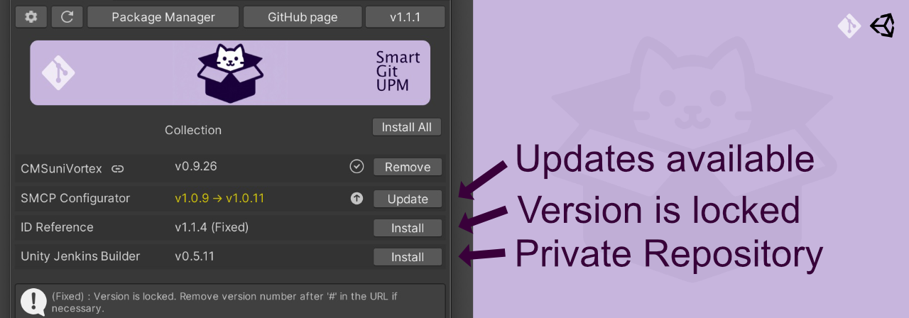

## このプラグインを利用する理由

### アップデートを一目で確認

Unity Package Managerは、Gitで公開されているパッケージのアップデート情報を知る事ができません。
`SmartGitUPM`なら分かりやすいUIで確認できます。

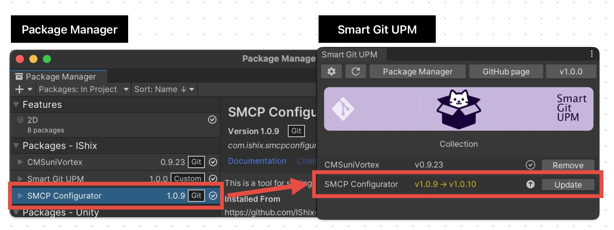

### プライベートリポジトリの更新確認に対応

プライベートリポジトリ(SSL接続)のパッケージに対応。更新確認がプライベートリポジトリでも可能です。

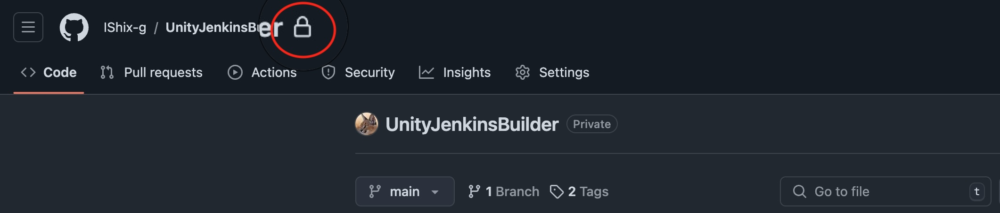

- SSLを設定し、SSL用のURLを指定。例) `git@github.com:IShix-g/SmartGitUPM.git`
- 大きなプライベートリポジトリは、初回の表示に時間がかかります。
- パブリックリポジトリに大小は関係なく、表示速度は変わりません。

### 更新通知

Unity Editorを開く度に、パッケージの更新があれば通知を受け取る事ができます。(通知の停止可)

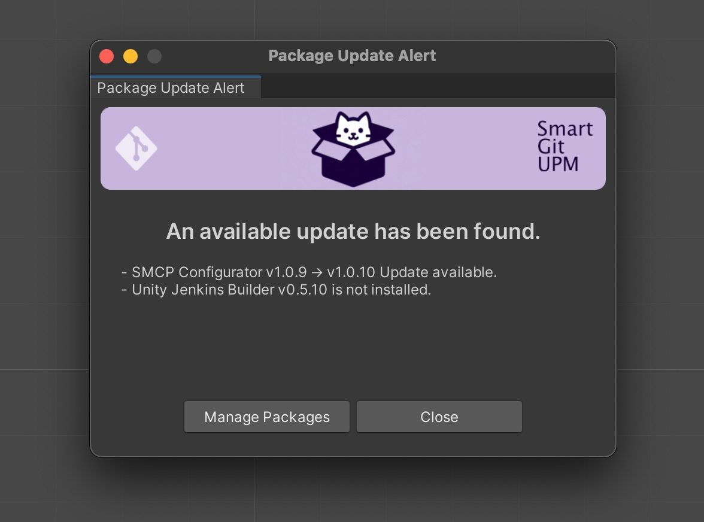

### 内部ではUPMを利用しているので安心

内部では、Unity Package Manager(UPM)を利用しパッケージ管理をしているので安心。
もし、`SmartGitUPM`が気に入らなくなっても削除すればおしまいです。以降は、UPMで通常通り管理できます。

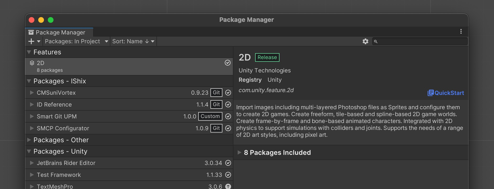

## Getting Started

### Git Urlからインストール

"Unity Editor : Window > Package Manager > Add package from git URL...".

URL: `https://github.com/IShix-g/SmartGitUPM.git?path=Packages/SmartGitUPM`

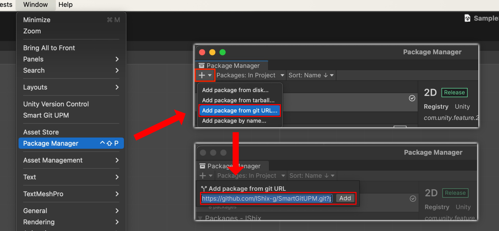

### SmartGitUPMを開く

`Unity Editor : Window > Smart Git UPM`

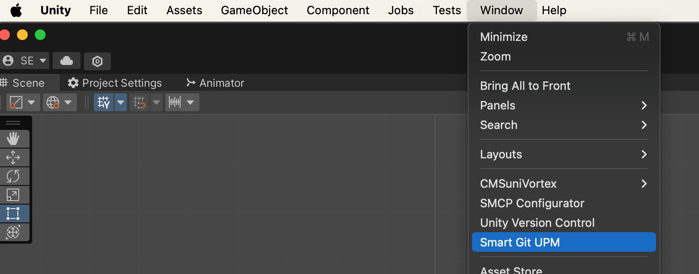

### 設定を開く

歯車ボタン、もしくは未設定時のみ表示される設定ボタンをクリック

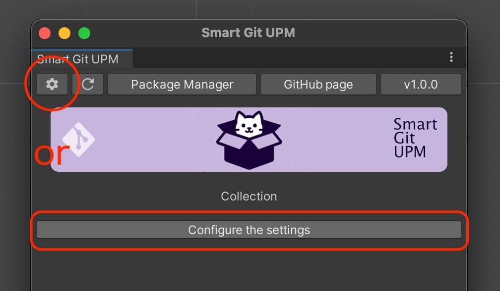

### パッケージを設定

| フィールド                    | 説明                              | 例                                                                                                                                                           |
|--------------------------|---------------------------------|-------------------------------------------------------------------------------------------------------------------------------------------------------------|
| Update Notify            | Unity Editor起動時にアップデートの通知を受けるか？ | [チェックした場合] アップデートを受け取る                                                                                                                                      |
| Install Url              | パッケージのインストールURL (https or SSL)  | [https] https://github.com/IShix-g/CMSuniVortex.git?path=Packages/CMSuniVortex [SSL] git@github.com:IShix-g/CMSuniVortex.git?path=Packages/CMSuniVortex |
| Branch (Optional)        | 必要あればブランチ名を指定                   | 空欄 または `main` や `master` など                                                                                                                                 |
| Help Page Url (Optional) | 必要あればヘルプページを指定                  | 空欄 または ヘルプページのURL https://github.com/IShix-g/CMSuniVortex など                                                                                                |

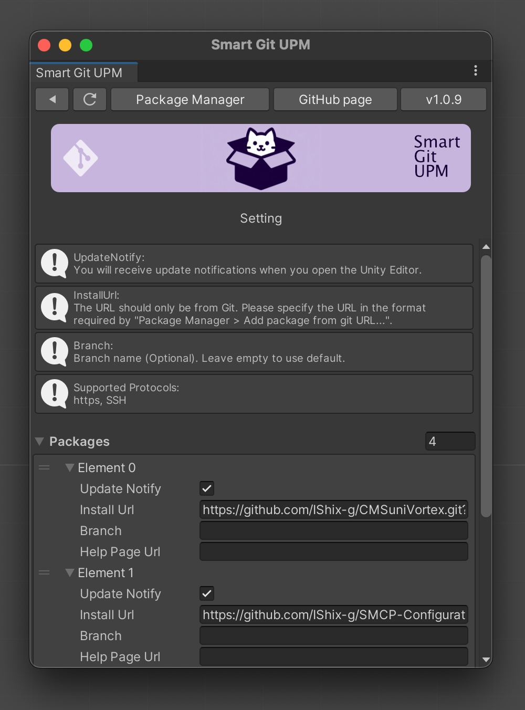

### リロード

設定後、リロードボタンをクリックして完了です。
次回からは、下記タイミングでリロード処理が実行されます。

- Unity Editorを起動した時
- Smart Git UPMを表示した時

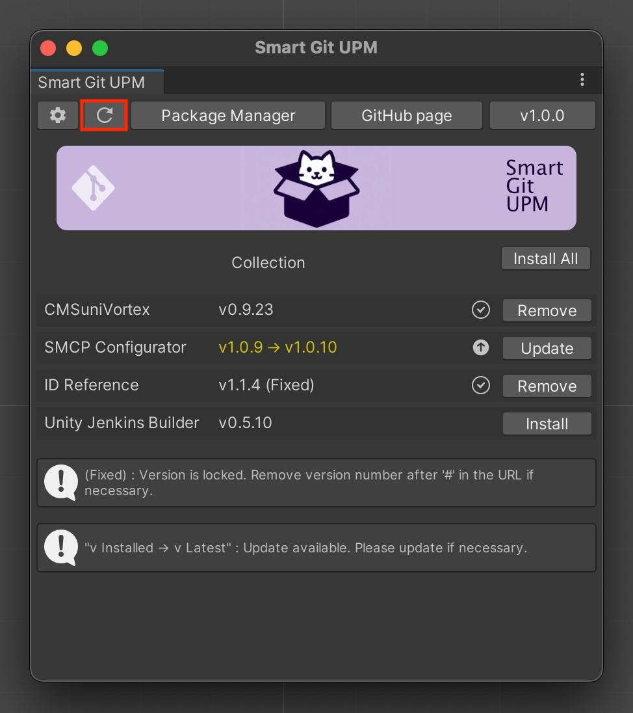

## 各ボタンの説明

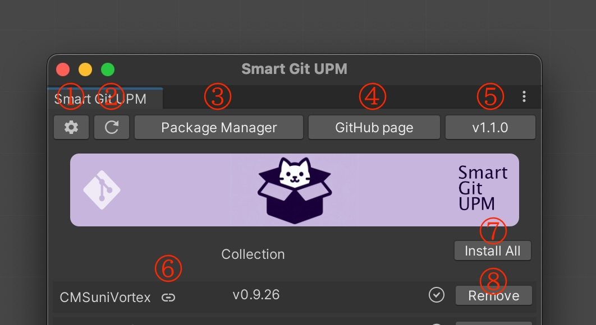

1. パッケージの設定
2. パッケージのアップデート情報の再取得
3. Unity Package Managerを開く
4. Smart Git UPMのGitHubページを開く
5. Smart Git UPMのバージョン、クリックで最新バージョンがあるか確認します。

## 現在のパッケージの状態表示

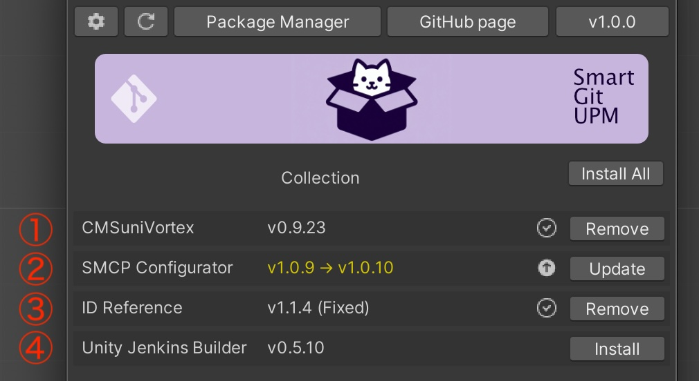

1. 最新バージョンのインストール済み
2. インストール済み、且つ更新可能な新バージョンあり v1.0.9 (現在) -> v1.0.10 (新)
3. インストール済み、且つバージョンの固定、URLの最後に`#1.1.4`などのバージョンを指定する事で固定可
4. 未インストール

## UPMとの役割分担

SmartGitUPMは、Unity Package Manager(UPM)が行わないGitのバージョン情報を視覚化したり、更新の通知をするプラグインです。
実際のインストールやアンストールは、Unity Package Managerに依頼します。

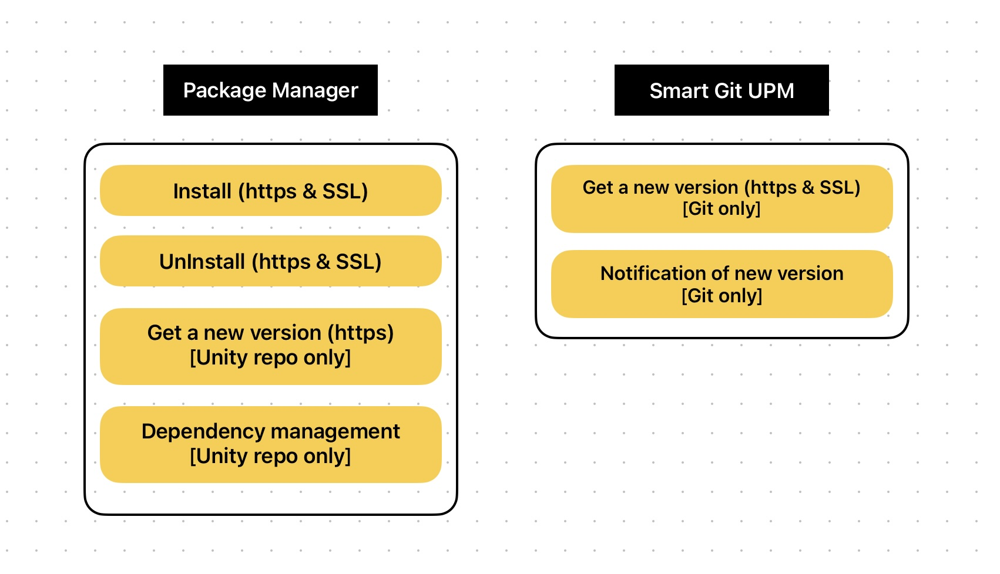

## OpenUPMとの違い

### OpenUPM
OpenUPMはオープンソースパッケージのレジストリです。登録されたパッケージをUnity Package Managerを通じて管理できます。パブリックに公開されたオープンソースパッケージを対象としています。

### SmartGitUPM
SmartGitUPMは登録の必要がなく、ユーザーが自身で必要なパッケージを管理します。パブリック、プライベートのパッケージを問わず、独自のインターフェース（UI）で柔軟に管理することが可能です。

_※ ロゴがほぼ一緒ですが、狙った訳ではありません。**「パッケージ = ダンボール = ねこ」** ダンボールが大好きな猫がダンボールで遊んでいるロゴにしようと作ったら、同じようなロゴになってしまいました。可愛すぎて変更したくなかったのでしばらくこのままでいかせてください。すみません。_

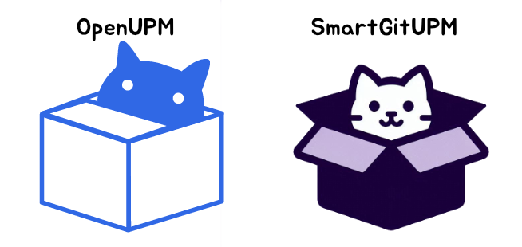